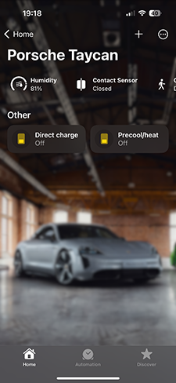
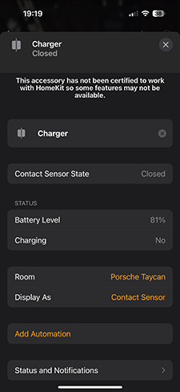
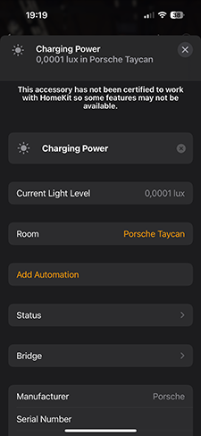
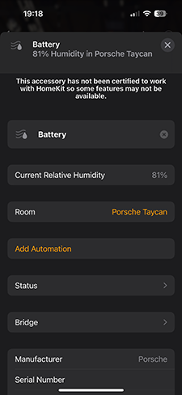
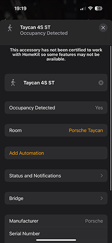

# Homebridge Porsche EV
[](https://github.com/homebridge/homebridge/wiki/Verified-Plugins)
[](https://www.npmjs.com/package/homebridge-porsche-taycan)
[](https://www.npmjs.com/package/homebridge-porsche-taycan)

This Homebrudge plugin offers a range of useful features for your Porsche Taycan and Macan EV, including real-time monitoring of battery level, charging status and charging power. Moreover, it also enables you to easily toggle the direct climatisation option on or off and automate your home with your vehicles location.

## Supported vehicles:
- Taycan (MY19 and newer)
- Macan EV (MY25 and newer)

## Key features



- Switch for **Precool / heat**
- Switch for **Direct Charge**
- Sensor for your **Charger** with **SoC**
<sub><sup>A *contact sensor* will indicate if your vehicle is charging, SoC (battery level) is available as accessory characteristic or as separate sensor</sub></sup>
- Sensor for the **Charging Power** (Optional)
<sub><sup>A *light (lux)* sensor will show current charging power. E.g. 10 lux means your vehicles charges with a speed of 10 kwh.</sub></sup>
- Sensor for the **Location** fo your vehicle (Optional)
<sub><sup>An *occupancy sensor* indicates if your vehicle is at home when the location of your vehicle is within 300 meters of your home</sub></sup>
- Sensor for the **SoC** (optional)
<sub><sup>By default SoC is available as characteristic of the charger sensor. Optionally the SoC can be exposed as *humidity sensor*.</sub></sup>

   

## Installation
To install the *Homebridge Porsche Taycan* plugin follow these steps:

- Follow the instructions on the [Homebridge Wiki](https://homebridge.io/how-to-install-homebridge) to install Node.js and Homebridge;
- Install the *Homebridge Porsche Taycan* plugin through Homebridge Config UI X or manually;
  ```
  $ sudo npm -g i homebridge-porsche-taycan
  ```
- Edit config.json and add the *Porsche Taycan* platform. E.g;
    ```
    {
        "username": "<<Porsche Connect username>>",
        "password": "<<Porsche Connect password>>",
        "pollInterval": 30,
        "batteryDevice": false,
        "chargingPowerDevice": true,
        "lowBattery": 40,
        "platform": "PorscheTaycan",
        locationConfig: {
          "lat": "<<Latitude of your home address>>",
          "long": "<<Longitude of your home address>>",
        }
    }
    ```
  In above example the charging state and battery level are updated every 30 minutes. The battery level is considered low when the SoC drops below 40. No separate battery level device is exposed, but the current charging power is.

## Caveats
- The plugin can throw authentication errors. The login method used from Porsche's API expects a captcha now and then. As a work around logon to my.porsche.com and restart the plugin. Logging in on my.porsche.com reset the need for a captcha.
- Precool/heat cools or heats your vehicle on activation, the desired temperature can only be changed in the My Porsche app when setting a charge timer.

## Credits
This plugin is not an official plugin from Porsche. The usage of Porsche Connect API endpoints are reverse engineered on MyPorsche with help of Google Chrome Dev tools. It uses the unofficial 'porsche-connect' node package to communicate to Porsches servers.

This plugin started as a hobby project but is now available to the public. Pull requests to improve the plugins are more than welcome. 
